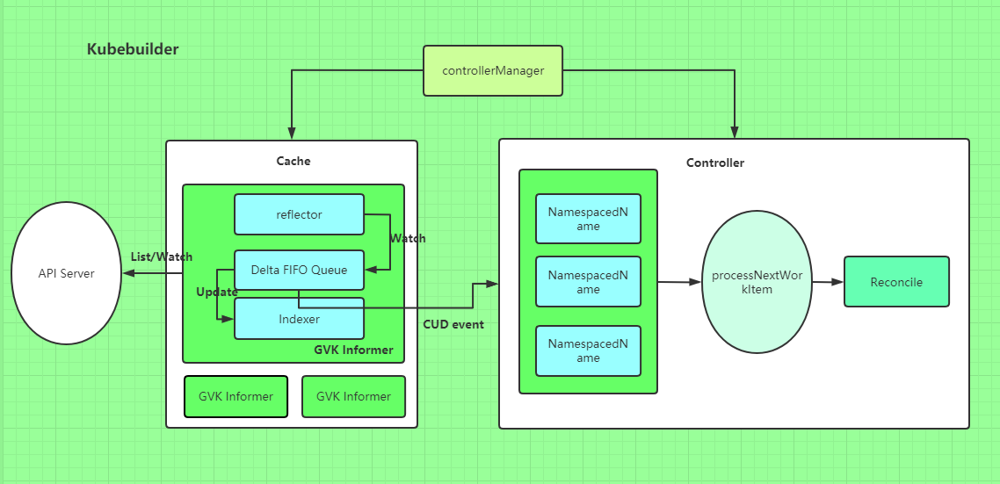

# crd-kubebuilder

## build

*run*
make
make install # install crd
make run # start controller

*把controller部署到集群中*

make docker-build # build image of controller
make docker-push
make deploy # set image of controller deployment

## work flow

`make && make install && make run`

1. *add fields*

```
api/v1/virtulmachine_types.go

// VirtulMachineSpec defines the desired state of VirtulMachine
// 在这里加信息
type VirtulMachineSpec struct {
    // INSERT ADDITIONAL SPEC FIELDS - desired state of cluster
    // Important: Run "make" to regenerate code after modifying this file
    CPU    string `json:"cpu"`   // 这是我增加的
    Memory string `json:"memory"`
}

// VirtulMachineStatus defines the observed state of VirtulMachine
// 在这里加状态信息，比如虚拟机是启动状态，停止状态啥的
type VirtulMachineStatus struct {
    // INSERT ADDITIONAL STATUS FIELD - define observed state of cluster
    // Important: Run "make" to regenerate code after modifying this file
}
```

2.1 *change controller flow*

```
vim config/controller/virtulmachine_controller.yaml

func (r *VirtulMachineReconciler) Reconcile(req ctrl.Request) (ctrl.Result, error) {
    ctx = context.Background()
    _ = r.Log.WithValues("virtulmachine", req.NamespacedName)

    vm := &v1.VirtulMachine{}
    if err := r.Get(ctx, req.NamespacedName, vm); err != nil { # 获取VM信息
        log.Error(err, "unable to fetch vm")
    } else {
        fmt.Println(vm.Spec.CPU, vm.Spec.Memory) # 打印CPU内存信息
    }

    return ctrl.Result{}, nil
}
```

2.2 *make && make install && make run*

start controller

3. *viwer crd*

kustomize build config/default
or cat config/crd/bases/seven.seven.com_.yaml

4. *deploy crd*

edit config/samples/seven_v1_virtulmachine.yaml
kubectl apply -f config/samples

5. *viwer log and crd ymal*

kubectl get virtulmachines.seven.seven.com virtulmachine-seven -o yaml

## resource reader

*main.go*

init 方法里面我们将 appsv1alpha1 注册到 Scheme 里面去了，这样一来 Cache 就知道 watch 谁了，main 方法里面的逻辑基本都是 Manager 的：

1.1 初始化了一个 Manager；
1.2 将 Manager 的 Client 传给 Controller，并且调用 SetupWithManager 方法传入 Manager 进行 Controller 的初始化；
1.3 启动 Manager。

```
var (
	scheme   = runtime.NewScheme()
	setupLog = ctrl.Log.WithName("setup")
)
func init() {
	appsv1alpha1.AddToScheme(scheme)
	// +kubebuilder:scaffold:scheme
}
func main() {
	...
        // 1、init Manager
	mgr, err := ctrl.NewManager(ctrl.GetConfigOrDie(), ctrl.Options{Scheme: scheme, MetricsBindAddress: metricsAddr})
	if err != nil {
		setupLog.Error(err, "unable to start manager")
		os.Exit(1)
	}
        // 2、init Reconciler（Controller）
	err = (&controllers.ApplicationReconciler{
		Client: mgr.GetClient(),
		Log:    ctrl.Log.WithName("controllers").WithName("Application"),
		Scheme: mgr.GetScheme(),
	}).SetupWithManager(mgr)
	if err != nil {
		setupLog.Error(err, "unable to create controller", "controller", "EDASApplication")
		os.Exit(1)
	}
	// +kubebuilder:scaffold:builder
	setupLog.Info("starting manager")
        // 3、start Manager
	if err := mgr.Start(ctrl.SetupSignalHandler()); err != nil {
		setupLog.Error(err, "problem running manager")
		os.Exit(1)
	}
```

*Manager 初始化*

创建 Cache 与 Clients：

```
// New returns a new Manager for creating Controllers.
func New(config *rest.Config, options Options) (Manager, error) {
	...
	// Create the cache for the cached read client and registering informers
	cache, err := options.NewCache(config, cache.Options{Scheme: options.Scheme, Mapper: mapper, Resync: options.SyncPeriod, Namespace: options.Namespace})
	if err != nil {
		return nil, err
	}
	apiReader, err := client.New(config, client.Options{Scheme: options.Scheme, Mapper: mapper})
	if err != nil {
		return nil, err
	}
	writeObj, err := options.NewClient(cache, config, client.Options{Scheme: options.Scheme, Mapper: mapper})
	if err != nil {
		return nil, err
	}
	...
	return &controllerManager{
		config:           config,
		scheme:           options.Scheme,
		errChan:          make(chan error),
		cache:            cache,
		fieldIndexes:     cache,
		client:           writeObj,
		apiReader:        apiReader,
		recorderProvider: recorderProvider,
		resourceLock:     resourceLock,
		mapper:           mapper,
		metricsListener:  metricsListener,
		internalStop:     stop,
		internalStopper:  stop,
		port:             options.Port,
		host:             options.Host,
		leaseDuration:    *options.LeaseDuration,
		renewDeadline:    *options.RenewDeadline,
		retryPeriod:      *options.RetryPeriod,
	}, nil
}
```

*创建 Cache*

Cache 主要就是创建了 InformersMap，Scheme 里面的每个 GVK 都创建了对应的 Informer，通过 
informersByGVK 这个 map 做 GVK 到 Informer 的映射，每个 Informer 会根据 ListWatch 函数对对应的 GVK 进行 List 和 Watch。

```
// New initializes and returns a new Cache.
func New(config *rest.Config, opts Options) (Cache, error) {
	opts, err := defaultOpts(config, opts)
	if err != nil {
		return nil, err
	}
	im := internal.NewInformersMap(config, opts.Scheme, opts.Mapper, *opts.Resync, opts.Namespace)
	return &informerCache{InformersMap: im}, nil
}
// newSpecificInformersMap returns a new specificInformersMap (like
// the generical InformersMap, except that it doesn't implement WaitForCacheSync).
func newSpecificInformersMap(...) *specificInformersMap {
	ip := &specificInformersMap{
		Scheme:            scheme,
		mapper:            mapper,
		informersByGVK:    make(map[schema.GroupVersionKind]*MapEntry),
		codecs:            serializer.NewCodecFactory(scheme),
		resync:            resync,
		createListWatcher: createListWatcher,
		namespace:         namespace,
	}
	return ip
}
// MapEntry contains the cached data for an Informer
type MapEntry struct {
	// Informer is the cached informer
	Informer cache.SharedIndexInformer
	// CacheReader wraps Informer and implements the CacheReader interface for a single type
	Reader CacheReader
}
func createUnstructuredListWatch(gvk schema.GroupVersionKind, ip *specificInformersMap) (*cache.ListWatch, error) {
        ...
	// Create a new ListWatch for the obj
	return &cache.ListWatch{
		ListFunc: func(opts metav1.ListOptions) (runtime.Object, error) {
			if ip.namespace != "" && mapping.Scope.Name() != meta.RESTScopeNameRoot {
				return dynamicClient.Resource(mapping.Resource).Namespace(ip.namespace).List(opts)
			}
			return dynamicClient.Resource(mapping.Resource).List(opts)
		},
		// Setup the watch function
		WatchFunc: func(opts metav1.ListOptions) (watch.Interface, error) {
			// Watch needs to be set to true separately
			opts.Watch = true
			if ip.namespace != "" && mapping.Scope.Name() != meta.RESTScopeNameRoot {
				return dynamicClient.Resource(mapping.Resource).Namespace(ip.namespace).Watch(opts)
			}
			return dynamicClient.Resource(mapping.Resource).Watch(opts)
		},
	}, nil
}
```

*client*

读操作使用上面创建的 Cache，写操作使用 K8s go-client 直连

```
// defaultNewClient creates the default caching client
func defaultNewClient(cache cache.Cache, config *rest.Config, options client.Options) (client.Client, error) {
	// Create the Client for Write operations.
	c, err := client.New(config, options)
	if err != nil {
		return nil, err
	}
	return &client.DelegatingClient{
		Reader: &client.DelegatingReader{
			CacheReader:  cache,
			ClientReader: c,
		},
		Writer:       c,
		StatusClient: c,
	}, nil
}
```

*Controller 初始化*

```
func (r *EDASApplicationReconciler) SetupWithManager(mgr ctrl.Manager) error {
	err := ctrl.NewControllerManagedBy(mgr).
		For(&appsv1alpha1.EDASApplication{}).
		Complete(r)
return err
}
```

使用的是 Builder 模式，NewControllerManagerBy 和 For 方法都是给 Builder 传参，最重要的是最后一个方法 Complete，其逻辑是：

```
func (blder *Builder) Build(r reconcile.Reconciler) (manager.Manager, error) {
...
	// Set the Manager
	if err := blder.doManager(); err != nil {
		return nil, err
	}
	// Set the ControllerManagedBy
	if err := blder.doController(r); err != nil {
		return nil, err
	}
	// Set the Watch
	if err := blder.doWatch(); err != nil {
		return nil, err
	}
...
	return blder.mgr, nil
}
```

*doController 方法*

```
func New(name string, mgr manager.Manager, options Options) (Controller, error) {
	if options.Reconciler == nil {
		return nil, fmt.Errorf("must specify Reconciler")
	}
	if len(name) == 0 {
		return nil, fmt.Errorf("must specify Name for Controller")
	}
	if options.MaxConcurrentReconciles <= 0 {
		options.MaxConcurrentReconciles = 1
	}
	// Inject dependencies into Reconciler
	if err := mgr.SetFields(options.Reconciler); err != nil {
		return nil, err
	}
	// Create controller with dependencies set
	c := &controller.Controller{
		Do:                      options.Reconciler,
		Cache:                   mgr.GetCache(),
		Config:                  mgr.GetConfig(),
		Scheme:                  mgr.GetScheme(),
		Client:                  mgr.GetClient(),
		Recorder:                mgr.GetEventRecorderFor(name),
		Queue:                   workqueue.NewNamedRateLimitingQueue(workqueue.DefaultControllerRateLimiter(), name),
		MaxConcurrentReconciles: options.MaxConcurrentReconciles,
		Name:                    name,
	}
	// Add the controller as a Manager components
	return c, mgr.Add(c)
}
```

该方法初始化了一个 Controller，传入了一些很重要的参数：

- Do：Reconcile 逻辑；
- Cache：找 Informer 注册 Watch；
- Client：对 K8s 资源进行 CRUD；
- Queue：Watch 资源的 CUD 事件缓存；
- Recorder：事件收集

*doWatch 方法*

该方法对本 Controller 负责的 CRD 进行了 watch，同时底下还会 watch 本 CRD 管理的其他资源

```
func (blder *Builder) doWatch() error {
	// Reconcile type
	src := &source.Kind{Type: blder.apiType}
	hdler := &handler.EnqueueRequestForObject{}
	err := blder.ctrl.Watch(src, hdler, blder.predicates...)
	if err != nil {
		return err
	}
	// Watches the managed types
	for _, obj := range blder.managedObjects {
		src := &source.Kind{Type: obj}
		hdler := &handler.EnqueueRequestForOwner{
			OwnerType:    blder.apiType,
			IsController: true,
		}
		if err := blder.ctrl.Watch(src, hdler, blder.predicates...); err != nil {
			return err
		}
	}
	// Do the watch requests
	for _, w := range blder.watchRequest {
		if err := blder.ctrl.Watch(w.src, w.eventhandler, blder.predicates...); err != nil {
			return err
		}
	}
	return nil
}
```

这个 managedObjects 可以通过 Controller 初始化 Buidler 的 Owns 方法传入，说到 Watch 我们关心两个逻辑：

*1.1 注册的 handler*

Kubebuidler 为我们注册的 Handler 就是将发生变更的对象的 NamespacedName 入队列，如果在 Reconcile 逻辑中需要判断创建/更新/删除，需要有自己的判断逻辑。

```
type EnqueueRequestForObject struct{}
// Create implements EventHandler
func (e *EnqueueRequestForObject) Create(evt event.CreateEvent, q workqueue.RateLimitingInterface) {
        ...
	q.Add(reconcile.Request{NamespacedName: types.NamespacedName{
		Name:      evt.Meta.GetName(),
		Namespace: evt.Meta.GetNamespace(),
	}})
}
// Update implements EventHandler
func (e *EnqueueRequestForObject) Update(evt event.UpdateEvent, q workqueue.RateLimitingInterface) {
	if evt.MetaOld != nil {
		q.Add(reconcile.Request{NamespacedName: types.NamespacedName{
			Name:      evt.MetaOld.GetName(),
			Namespace: evt.MetaOld.GetNamespace(),
		}})
	} else {
		enqueueLog.Error(nil, "UpdateEvent received with no old metadata", "event", evt)
	}
	if evt.MetaNew != nil {
		q.Add(reconcile.Request{NamespacedName: types.NamespacedName{
			Name:      evt.MetaNew.GetName(),
			Namespace: evt.MetaNew.GetNamespace(),
		}})
	} else {
		enqueueLog.Error(nil, "UpdateEvent received with no new metadata", "event", evt)
	}
}
// Delete implements EventHandler
func (e *EnqueueRequestForObject) Delete(evt event.DeleteEvent, q workqueue.RateLimitingInterface) {
        ...
	q.Add(reconcile.Request{NamespacedName: types.NamespacedName{
		Name:      evt.Meta.GetName(),
		Namespace: evt.Meta.GetNamespace(),
	}})
}
```

*1.2注册的流程*

```
// Watch implements controller.Controller
func (c *Controller) Watch(src source.Source, evthdler handler.EventHandler, prct ...predicate.Predicate) error {
	...
	log.Info("Starting EventSource", "controller", c.Name, "source", src)
	return src.Start(evthdler, c.Queue, prct...)
}
// Start is internal and should be called only by the Controller to register an EventHandler with the Informer
// to enqueue reconcile.Requests.
func (is *Informer) Start(handler handler.EventHandler, queue workqueue.RateLimitingInterface,
	...
	is.Informer.AddEventHandler(internal.EventHandler{Queue: queue, EventHandler: handler, Predicates: prct})
	return nil
}
```

我们的 Handler 实际注册到 Informer 上面，这样整个逻辑就串起来了，通过 Cache 我们创建了所有 Scheme 里面 GVKs 的 Informers，然后对应 GVK 的 Controller 注册了 Watch Handler 到对应的 Informer，这样一来对应的 GVK 里面的资源有变更都会触发 Handler，将变更事件写到 Controller 的事件队列中，之后触发我们的 Reconcile 方法。

*Manager 启动*

启动 Cache，Controller，将整个事件流运转起来

```
func (cm *controllerManager) Start(stop <-chan struct{}) error {
	...
	go cm.startNonLeaderElectionRunnables()
	...
}
func (cm *controllerManager) startNonLeaderElectionRunnables() {
	...
	// Start the Cache. Allow the function to start the cache to be mocked out for testing
	if cm.startCache == nil {
		cm.startCache = cm.cache.Start
	}
	go func() {
		if err := cm.startCache(cm.internalStop); err != nil {
			cm.errChan <- err
		}
	}()
        ...
        // Start Controllers
	for _, c := range cm.nonLeaderElectionRunnables {
		ctrl := c
		go func() {
			cm.errChan <- ctrl.Start(cm.internalStop)
		}()
	}
	cm.started = true
}
```

*Cache 启动*

```
func (ip *specificInformersMap) Start(stop <-chan struct{}) {
	func() {
		...
		// Start each informer
		for _, informer := range ip.informersByGVK {
			go informer.Informer.Run(stop)
		}
	}()
}
func (s *sharedIndexInformer) Run(stopCh <-chan struct{}) {
        ...
        // informer push resource obj CUD delta to this fifo queue
	fifo := NewDeltaFIFO(MetaNamespaceKeyFunc, s.indexer)
	cfg := &Config{
		Queue:            fifo,
		ListerWatcher:    s.listerWatcher,
		ObjectType:       s.objectType,
		FullResyncPeriod: s.resyncCheckPeriod,
		RetryOnError:     false,
		ShouldResync:     s.processor.shouldResync,
                // handler to process delta
		Process: s.HandleDeltas,
	}
	func() {
		s.startedLock.Lock()
		defer s.startedLock.Unlock()
                // this is internal controller process delta generate by reflector
		s.controller = New(cfg)
		s.controller.(*controller).clock = s.clock
		s.started = true
	}()
        ...
	wg.StartWithChannel(processorStopCh, s.processor.run)
	s.controller.Run(stopCh)
}
func (c *controller) Run(stopCh <-chan struct{}) {
	...
	r := NewReflector(
		c.config.ListerWatcher,
		c.config.ObjectType,
		c.config.Queue,
		c.config.FullResyncPeriod,
	)
	...
        // reflector is delta producer
	wg.StartWithChannel(stopCh, r.Run)
        // internal controller's processLoop is comsume logic
	wait.Until(c.processLoop, time.Second, stopCh)
}
```

Cache 的初始化核心是初始化所有的 Informer，Informer 的初始化核心是创建了 reflector 和内部 controller，reflector 负责监听 Api Server 上指定的 GVK，将变更写入 delta 队列中，可以理解为变更事件的生产者，内部 controller 是变更事件的消费者，他会负责更新本地 indexer，以及计算出 CUD 事件推给我们之前注册的 Watch Handler。

*Controller 启动*

```
// Start implements controller.Controller
func (c *Controller) Start(stop <-chan struct{}) error {
	...
	for i := 0; i < c.MaxConcurrentReconciles; i++ {
		// Process work items
		go wait.Until(func() {
			for c.processNextWorkItem() {
			}
		}, c.JitterPeriod, stop)
	}
	...
}
func (c *Controller) processNextWorkItem() bool {
	...
	obj, shutdown := c.Queue.Get()
	...
	var req reconcile.Request
	var ok bool
	if req, ok = obj.(reconcile.Request); 
        ...
	// RunInformersAndControllers the syncHandler, passing it the namespace/Name string of the
	// resource to be synced.
	if result, err := c.Do.Reconcile(req); err != nil {
		c.Queue.AddRateLimited(req)
		...
	} 
        ...
}
```

Controller 的初始化是启动 goroutine 不断地查询队列，如果有变更消息则触发到我们自定义的 Reconcile 逻辑。

### logic



## Summary

*如何同步自定义资源以及 K8s build-in 资源？*

需要将自定义资源和想要 Watch 的 K8s build-in 资源的 GVKs 注册到 Scheme 上，Cache 会自动帮我们同步。

*Controller 的 Reconcile 方法是如何被触发的？*

通过 Cache 里面的 Informer 获取资源的变更事件，然后通过两个内置的 Controller 以生产者消费者模式传递事件，最终触发 Reconcile 方法。

*Cache 的工作原理是什么？*

GVK -> Informer 的映射，Informer 包含 Reflector 和 Indexer 来做事件监听和本地缓存。

## kustomize

kustomize build config/default

ls config/webhook
- kustomization.yaml
- kustomizationconfig.yaml
- service.yaml

## go test

go test controllers/suite_test.go  -run=TestAPIs -v

## related blog

[kubebuilder](https://book.kubebuilder.io/)
[深入解析 Kubebuilder：让编写 CRD 变得更简单](https://www.cnblogs.com/alisystemsoftware/p/11580202.html)
[使用kubebuilder开发kubernetes CRD](https://segmentfault.com/a/1190000019892302)
[kubebuilder(1)-安装和使用](https://www.jianshu.com/p/de4dd9c9ad47)
[kubebuilder(2)-原理](https://www.jianshu.com/p/33ddd445b468)