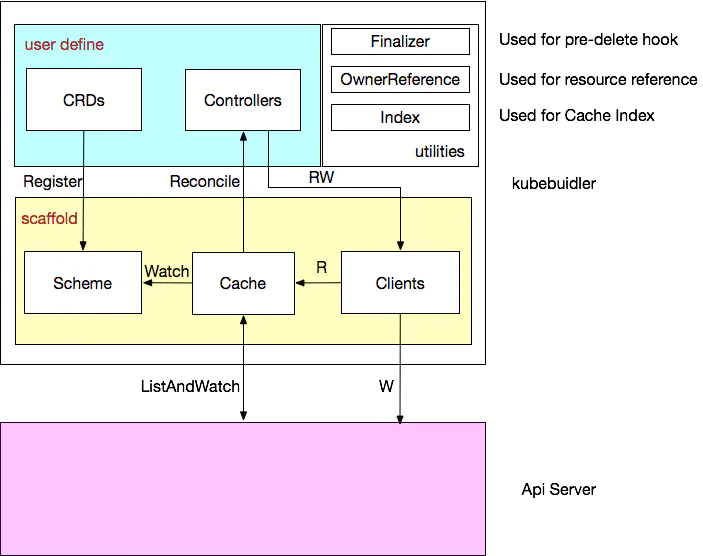

# Kubebuilder

## 摘要

Kubebuilder 是一个使用 CRDs 构建 K8s API 的 SDK，主要是：

- 提供脚手架工具初始化 CRDs 工程，自动生成 boilerplate 代码和配置；
- 提供代码库封装底层的 K8s go-client；
- 方便用户从零开始开发 CRDs，Controllers 和 Admission Webhooks 来扩展 K8s。

## 重要概念

kustomization：kustomization.yaml文件，一个含有kustomization.yaml的目录可以运行 kustomize build。kustomization.yaml的一个例子如下

```
bases:
-  /config/myapp1/base
-  /config/myapp2/base
resources:
- service.yaml
- deployment.yaml
patches:
- patch.yaml
namePrefix: my-
```

- base：含有一个kustomization.yaml文件的目录，可以被其他的kustomization.yaml来引用
- resource：文件路径，指向一个声明了kubernetes API对象的YAML文件
- patch: 文件路径，指向一个声明了kubernetes API patch的YAML文件
- variant: 含有同一组bases的不同kustomization

## 核心概念

**GVKs&GVRs**

GVK = GroupVersionKind，GVR = GroupVersionResource。

**API Group & Versions（GV）**

API Group 是相关 API 功能的集合，每个 Group 拥有一或多个 Versions，用于接口的演进。

**Kinds & Resources**

每个 GV 都包含多个 API 类型，称为 Kinds，在不同的 Versions 之间同一个 Kind 定义可能不同， Resource 是 Kind 的对象标识（resource type），一般来说 Kinds 和 Resources 是 1:1 的，比如 pods Resource 对应 Pod Kind，但是有时候相同的 Kind 可能对应多个 Resources，比如 Scale Kind 可能对应很多 Resources：deployments/scale，replicasets/scale，对于 CRD 来说，只会是 1:1 的关系。

每一个 GVK 都关联着一个 package 中给定的 root Go type，比如 apps/v1/Deployment 就关联着 K8s 源码里面 k8s.io/api/apps/v1 package 中的 Deployment struct，我们提交的各类资源定义 YAML 文件都需要写：

apiVersion：这个就是 GV 。
kind：这个就是 K。
根据 GVK K8s 就能找到你到底要创建什么类型的资源，根据你定义的 Spec 创建好资源之后就成为了 Resource，也就是 GVR。GVK/GVR 就是 K8s 资源的坐标，是我们创建/删除/修改/读取资源的基础。

**Scheme**

每一组 Controllers 都需要一个 Scheme，提供了 Kinds 与对应 Go types 的映射，也就是说给定 Go type 就知道他的 GVK，给定 GVK 就知道他的 Go type，比如说我们给定一个 Scheme: "tutotial.kubebuilder.io/api/v1".CronJob{} 这个 Go type 映射到 batch.tutotial.kubebuilder.io/v1 的 CronJob GVK，那么从 Api Server 获取到下面的 JSON:

{
    "kind": "CronJob",
    "apiVersion": "batch.tutorial.kubebuilder.io/v1",
    ...
}
就能构造出对应的 Go type了，通过这个 Go type 也能正确地获取 GVR 的一些信息，控制器可以通过该 Go type 获取到期望状态以及其他辅助信息进行调谐逻辑。

**Manager**

Kubebuilder 的核心组件，具有 3 个职责：

- 负责运行所有的 Controllers；
- 初始化共享 caches，包含 listAndWatch 功能；
- 初始化 clients 用于与 Api Server 通信。

**Cache**

Kubebuilder 的核心组件，负责在 Controller 进程里面根据 Scheme 同步 Api Server 中所有该 Controller 关心 GVKs 的 GVRs，其核心是 GVK -> Informer 的映射，Informer 会负责监听对应 GVK 的 GVRs 的创建/删除/更新操作，以触发 Controller 的 Reconcile 逻辑。

**Controller**

Kubebuidler 为我们生成的脚手架文件，我们只需要实现 Reconcile 方法即可。

**Clients**

在实现 Controller 的时候不可避免地需要对某些资源类型进行创建/删除/更新，就是通过该 Clients 实现的，其中查询功能实际查询是本地的 Cache，写操作直接访问 Api Server。

**Index**

由于 Controller 经常要对 Cache 进行查询，Kubebuilder 提供 Index utility 给 Cache 加索引提升查询效率。

**Finalizer**

在一般情况下，如果资源被删除之后，我们虽然能够被触发删除事件，但是这个时候从 Cache 里面无法读取任何被删除对象的信息，这样一来，导致很多垃圾清理工作因为信息不足无法进行，K8s 的 Finalizer 字段用于处理这种情况。在 K8s 中，只要对象 ObjectMeta 里面的 Finalizers 不为空，对该对象的 delete 操作就会转变为 update 操作，具体说就是 update deletionTimestamp 字段，其意义就是告诉 K8s 的 GC“在deletionTimestamp 这个时刻之后，只要 Finalizers 为空，就立马删除掉该对象”。

所以一般的使用姿势就是在创建对象时把 Finalizers 设置好（任意 string），然后处理 DeletionTimestamp 不为空的 update 操作（实际是 delete），根据 Finalizers 的值执行完所有的 pre-delete hook（此时可以在 Cache 里面读取到被删除对象的任何信息）之后将 Finalizers 置为空即可。

**OwnerReference**

K8s GC 在删除一个对象时，任何 ownerReference 是该对象的对象都会被清除，与此同时，Kubebuidler 支持所有对象的变更都会触发 Owner 对象 controller 的 Reconcile 方法。


